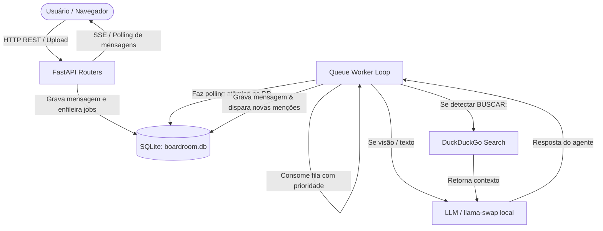

# Boardroom — Visão Geral e Arquitetura do Sistema

> **Objetivo deste documento:** Servir como referência técnica rápida e completa sobre o funcionamento, arquitetura, modelo de dados e regras de negócio do Boardroom, eliminando a necessidade de reexaminar todo o código-fonte a cada nova tarefa ou implementação.

---

## 1. O Que É o Boardroom

O **Boardroom** é uma aplicação web local focada na colaboração e debate entre **múltiplos agentes de inteligência artificial autônomos**, cada um com persona, modelo de linguagem e atribuições específicas.

O sistema simula um ambiente de reuniões ("sala de diretoria"), onde o usuário humano ou outros agentes podem convocar especialistas via menção (`@nome` ou `@all`). As mensagens geradas pelos agentes são processadas de forma estritamente serializada através de uma fila em banco de dados (`queue_jobs`), permitindo que múltiplos modelos ou agentes de grande porte rodem localmente em máquinas com restrições de VRAM de GPU (por meio de gerenciadores como o [llama-swap](https://github.com/mostlygeek/llama-swap) ou APIs compatíveis com OpenAI).

---

## 2. Stack Tecnológica

- **Backend:** Python 3.11+, FastAPI, Uvicorn, SQLite3 (nativo com foreign keys ativadas).
- **HTTP Client / LLM:** `httpx` para comunicação com endpoints OpenAI-compatíveis (`/v1/chat/completions`).
- **Processamento de Mídia & Documentos:**
  - **Pesquisa Web:** DuckDuckGo Search (`duckduckgo_search` / `ddgs`).
  - **Extração de PDF:** `fitz` (PyMuPDF).
  - **Síntese de Voz (TTS):** `piper-tts` (modelo local pt_BR).
  - **Visão Computacional:** Suporte a modelos multimodais de visão para análise e descrição de imagens (`describe_image`).
- **Frontend:** Single Page Application (SPA) em HTML5, CSS3 moderno (Vanilla, sem dependência de Tailwind/build tools) e JavaScript Vanilla.
- **Testes:** `pytest`, `pytest-asyncio`.

---

## 3. Arquitetura e Fluxo de Execução



### O Loop do Worker (`app/queue_worker.py`)
1. Roda em background na inicialização do FastAPI (`lifespan` em `app/main.py`).
2. Executa a função `_fetch_next_job()` de forma atômica (`priority ASC, id ASC`, transição `pending -> processing`).
3. Tipos de Jobs suportados:
   - `agent_turn` (prioridade 10): Execução do turno de um agente na conversa.
   - `describe_image` (prioridade 1): Alta prioridade para descrever uma imagem com modelo de visão antes que os agentes debatam sobre ela.
   - `extract_pdf` (prioridade 2): Extração de texto de PDFs anexados para alimentar o contexto da conversa.

---

## 4. Modelo de Dados (SQLite)

O banco de dados fica por padrão em `./data/boardroom.db` (configurável via variável de ambiente `BOARDROOM_DB_PATH`).

### Principais Tabelas:

| Tabela | Descrição |
|---|---|
| `agents` | Cadastro dos agentes: `id`, `name` (único, suporta palavras compostas como "Diretor Geral"), `persona_prompt`, `subtitle`, `model_name`, `vision_capable` (0 ou 1), `created_at`. |
| `agent_categories` | Categorias organizacionais para agrupar agentes na interface (ex: Financeiro, Presidência, Clipe Infantil). |
| `agent_category_members` | Associação NxN entre `agent_categories` e `agents`. |
| `groups` | Salas/equipes temáticas: `id`, `name` (único), `icon` (emoji, ex: 💬, 🎬), `created_at`. |
| `group_members` | Associação NxN entre `groups` e `agents` (define quem participa de cada grupo). |
| `conversations` | Canais/conversas dentro de cada grupo (`group_id`, `name`, `stopped_at`, `created_at`). Todo grupo já nasce com a conversa `Geral`. |
| `messages` | Histórico de mensagens: `conversation_id`, `sender_type` ('user', 'agent', 'system'), `sender_id` (id do agente ou null), `content`, `image_path`, `pdf_path`, `hidden`, `hidden_kind`, `created_at`. |
| `queue_jobs` | Fila persistente de tarefas: `conversation_id`, `agent_id`, `job_type`, `priority`, `payload`, `status` ('pending', 'processing', 'done', 'error'). |
| `settings` | Configurações chave-valor: `llama_swap_base_url`, `default_vision_model`, `assistant_model`, `max_history_messages`, `max_pending_per_group`. |
| `conversation_agent_mention_settings` | Controle granular por conversa se um agente só pode ser acionado por humanos (`human_only_mention = 1`), impedindo que outros agentes o invoquem. |

---

## 5. Menções e Orquestração (`app/mentions.py` & `app/routers/messages.py`)

1. **Resolução Inteligente de Menções (`resolve_mentions`)**:
   - Reconhece tanto agentes de nome simples (`@Leo`, `@Ana`) quanto de **nome composto com espaços** (`@Diretor Geral`, `@Analista de Letra`, `@Osvaldo Tibúrcio`).
   - A busca avalia o maior nome coincidente (`longest match wins`), evitando conflitos entre prefixos.
   - Suporta `@all`, que distribui turnos para todos os membros do grupo.
2. **Proteção Contra Loops Infinitos**:
   - Bloqueio de auto-menção (um agente mencionando a si mesmo não enfileira novo turno).
   - Limite de trocas consecutivas em loop estrito entre dois agentes (`MAX_CONSECUTIVE_MENTION_EXCHANGES`).
   - Bloqueio de novos jobs se o usuário acionar o botão de parada (`conversations.stopped_at`).

---

## 6. Protocolos Especiais Injetados no System Prompt

O `queue_worker` injeta automaticamente diretrizes no início do turno de cada agente:

1. **Roster do Grupo (`_group_roster_content`)**:
   - Informa ao agente a lista de todos os colegas do grupo e seus respectivos subtítulos (`- @Nome: Subtítulo`), permitindo que saiba exatamente a quem delegar tarefas.
2. **Pesquisa na Internet (`BUSCAR:`)**:
   - Se o agente precisa de fatos ou regras atuais, responde exclusivamente: `BUSCAR: sua consulta aqui`.
   - O worker intercepta, executa a busca no DuckDuckGo, insere a resposta do sistema no histórico e invoca o LLM novamente (até 3 buscas por turno).
3. **Pular Turno (`[[SKIP]]`)**:
   - Se o agente foi mencionado apenas por cortesia ou nada tem a acrescentar, emite `[[SKIP]]`. O worker descarta a mensagem silenciosamente sem poluir a conversa.
4. **Pausa para o Usuário (`[[AGUARDANDO_USUARIO]]` / `[[WAIT_USER]]`)**:
   - Se o agente precisa de dados, números, preenchimento de campos ou aprovação do cliente, emite essa tag (ou o worker detecta via heurística de formulários).
   - O sistema pausa os demais jobs pendentes da fila até que o usuário responda.

---

## 7. Estrutura de Diretórios do Projeto

```
boardroom/
├── app/
│   ├── main.py                  # Ponto de entrada FastAPI, lifespan e registro de rotas
│   ├── db.py                    # Schema SQLite, conexões e migrações incrementais
│   ├── llm_client.py            # Wrapper HTTP para API OpenAI/llama-swap
│   ├── mentions.py              # Extrator e resolvedor de @menções
│   ├── pdf_extract.py           # Leitor PyMuPDF para extração de texto
│   ├── queue_worker.py          # Worker serial da fila, injeção de prompts e ferramentas
│   ├── tts.py                   # Integração de áudio com Piper TTS
│   ├── web_search.py            # Módulo de busca DuckDuckGo
│   ├── routers/                 # Rotas da API REST (agents, groups, messages, settings, etc.)
│   └── static/                  # Frontend SPA (HTML, CSS, JS)
├── data/
│   └── boardroom.db             # Banco de dados SQLite padrão
├── docs/                        # Documentação, especificações de times e backlogs
├── scripts/                     # Scripts utilitários e de carga/seed
├── tests/                       # Testes automatizados pytest
├── start.bat / stop.bat         # Scripts de execução em background no Windows
└── requirements.txt             # Dependências Python do projeto
```

---

## 8. Como Cadastrar Novos Agentes e Times

Para cadastrar um novo time no Boardroom programaticamente ou via script de banco:
1. **Defina o Prompt Base e Bloco do Agente:** O system prompt do agente é a concatenação das regras gerais com sua especialidade.
2. **Atribua Nomes Diretos para Menções:** Se o diretor ou agentes chamam `@Especialista X`, cadastre o nome do agente exatamente como `Especialista X` no banco.
3. **Crie a Categoria Organizacional** em `agent_categories`.
4. **Insira os Agentes** em `agents` e vincule em `agent_category_members`.
5. **Crie o Grupo** em `groups` (com ícone temático) e a conversa inicial em `conversations`.
6. **Vincule os Membros** em `group_members`.
